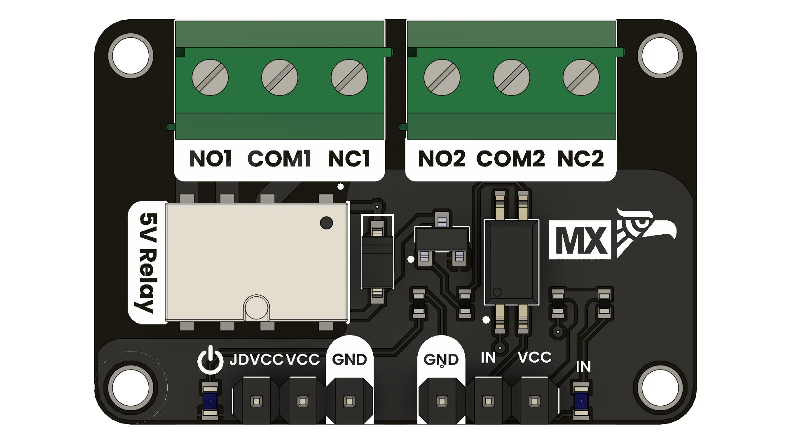

# UNIT Relay Module

This two-channel relay module is designed to interac with a microcontroller with higher-voltage or higher-current loads safely and reliably. It features:

* **Separate relay-coil supply:** allows using a dedicated 5 V rail for the relays.

* **Logic supply:** matches your MCU’s I/O voltage (3.3 V or 5 V).

* **Control input:** accept digital signals to switch each relay.

* **Relay contacts (NO, NC, COM):** provide both normally-open and normally-closed switching options.

---

# Description 

### JDVCC
Supplies a dedicated **+5 V** to the relay coils. By isolating coil power from the MCU’s logic rail, you can drive 5 V relays even if your microcontroller operates at 3.3 V.

### VCC
**Powers the input-driver circuitry.** Must match the MCU’s I/O voltage—either 3.3 V or 5 V—to ensure reliable signal detection on IN.

### IN
Digital control lines from the microcontroller. A logic-high level (~VCC) on IN **activates** the optocoupler and closes that **relay’s contacts.**

### NO1 / NO2 (Normally Open)
Contacts that **remain open** when the **relay is de-energized** and close to COMx when the coil is energized, allowing current flow only during activation.

### COM1 / COM2 (Common)
The shared terminal of each relay. It **switches between NCx and NOx** depending on whether the relay coil is energized.

### NC1 / NC2 (Normally Closed)
Contacts that are **closed to COMx when the relay is de-energized** and open when the coil is energized, interrupting the circuit upon activation.

### LED_PWR
A power-status LED that lights whenever JDVCC (5 V to the relays) is present, **confirming the module is energized.**

### LED_IN
An input-signal LED that lights or blinks whenever IN receives a logic-high from the MCU, providing **visual feedback of control signals.**

<a href="#">  UNIT Relay Module</a>

