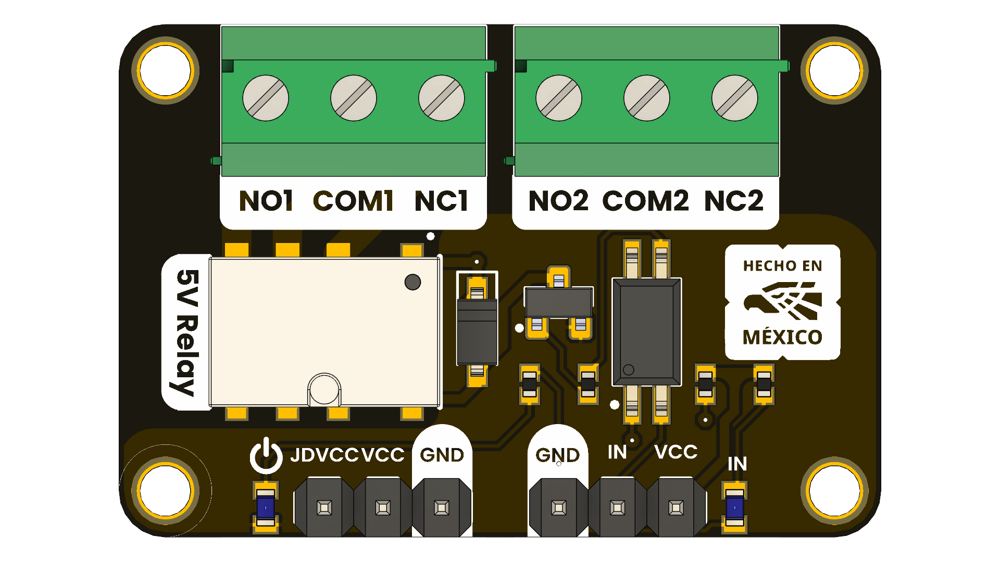

# DevLab: G6K-2G-Y-TR 5V Relay Module

This dual-channel relay module is engineered to safely and reliably interface with microcontrollers that manage higher-voltage or higher-current loads. It provides a dedicated 5 V supply for powering the relay coils while the logic supply is aligned with the microcontroller’s I/O voltage (3.3 V or 5 V). The module accepts digital control signals to toggle the relays, and the relay contacts are designed with both normally-open (NO) and normally-closed (NC) configurations, offering versatile switching options.

  
  
  
  
   

    <a href="#">  UNIT Relay Module</a>

### Quick Setup

## **Features**
- **1 × 5V relay** with Normally Open (NO) and Normally Closed (NC) contacts  
- **Optical isolation** between control (logic) and power (coil) sides  
- **LED indicators**: one for power and one per channel  
- Compatible with **3.3V or 5V logic**  
- **Screw terminals** for secure connection of power loads

## Common Applications

- Home Automation
- IoT Projects
- Automated Irrigation
- Testing & Laboratory
- Robotics & Mechatronics
- Smart Agriculture
- Security & Alarm Systems
- Education & Demos

## Support
For any issues or further assistance, please open an issue on the GitHub repository or contact our support team.

## License
This project is licensed under the MIT License - see the [LICENSE](LICENSE) file for details.

## Resources
- [Product brief](docs/unit_relay_module_g6k_2g_y_tr_dc5_product_brief.pdf)
- [Schematic](hardware/unit_sch_v_0_0_1ue0082_modulo_rele_g6k_.pdf)

