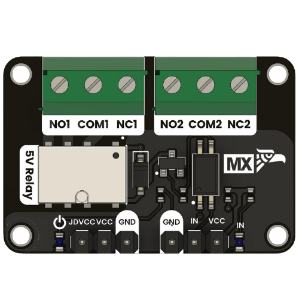

# Relay Module

This dual-channel relay module is engineered to safely and reliably interface with microcontrollers that manage higher-voltage or higher-current loads. It provides a dedicated 5 V supply for powering the relay coils while the logic supply is aligned with the microcontroller’s I/O voltage (3.3 V or 5 V). The module accepts digital control signals to toggle the relays, and the relay contacts are designed with both normally-open (NO) and normally-closed (NC) configurations, offering versatile switching options.

<div align="center">
    <a href="./unit_relay_module_g6k_2g_y_tr_dc5.pdf"><br/> UNIT Relay Module</a>
</div>

## Additional Resources

<div align="center">

| Resource              | Link                                                                                                                        |
|:---------------------:|:---------------------------------------------------------------------------------------------------------------------------:|
| Wiki-UNIT Electronics | [Wiki - UNIT Electronics](https://unit-electronics-mx.github.io/wiki_uelectronics/docs/Modules/relay/)                      |
| Github Repository     | [Github Repository](https://github.com/UNIT-Electronics-MX/unit_relay_module_g6k_2g_y_tr_dc5)                               |
| Product Brief         | [Product brief](docs/unit_relay_module_g6k_2g_y_tr_dc5_product_brief.pdf)                                                   |
| Schematic             | [Schematic](hardware/unit_sch_v_0_0_1ue0082_modulo_rele_g6k_.pdf)                                                           |

</div>

## **Features**
- **2 × 5 V relays** with Normally Open (NO) and Normally Closed (NC) contacts  
- **Optical isolation** between control (logic) and power (coil) sides  
- **LED indicators**: one for power and one per channel  
- Compatible with **3.3 V or 5 V logic**  
- **Screw terminals** for secure connection of power loads    


## **Description** 

<div align="center">

| Signal         | Description                                                                  |
|----------------|------------------------------------------------------------------------------|
| JDVCC          | +5V for relay coils; isolated from MCU logic, enabling 3.3V systems.         |
| VCC            | Powers input drivers; must match MCU voltage (3.3V or 5V).                   |
| IN             | MCU signal; high (~VCC) activates the optocoupler and relay.                 |
| NO1 / NO2      | Normally open contacts; close only when the relay is energized.              |
| COM1 / COM2    | Common terminal toggling between NC and NO.                                |
| NC1 / NC2      | Normally closed contacts; open when the relay is active.                     |
| LED_PWR        | LED showing JDVCC (5V) presence.                                               |
| LED_IN         | LED indicating control signal activity from IN.                            |

</div>


## Common Applications

- Home Automation
- Industrial Automation
- IoT Projects
- Automated Irrigation
- HVAC Control
- Renewable Energy
- Testing & Laboratory
- Robotics & Mechatronics
- Smart Agriculture
- Vehicle Power Management
- Audio & Signaling
- Security & Alarm Systems
- Education & Demos

## Documentation and Setup

### Overview
This repository contains firmware and documentation for integrating the Relay Module into your projects.

### Installation
1. Clone the repository:
   ```
   git clone git@github.com:UNIT-Electronics-MX/unit_relay_module_g6k_2g_y_tr_dc5.git
   ```
2. Navigate to the project directory:
   ```
   cd ./unit_buck_relay_module_g6k_2g_y_tr_dc5
   ```
3. Follow the platform-specific setup instructions detailed in the project documentation.

### Usage
Include the sensor initialization and configuration routines in your main project file. Sample code snippets and detailed explanations can be found in the documentation folder of the repository.


## Support
For any issues or further assistance, please open an issue on the GitHub repository or contact our support team.


## License MIT
This project is licensed under the MIT License - see the [LICENSE](LICENSE) file for details.

## Resources
- [Product brief](docs/unit_relay_module_g6k_2g_y_tr_dc5_product_brief.pdf)
- [Schematic](hardware/unit_sch_v_0_0_1ue0082_modulo_rele_g6k_.pdf)


