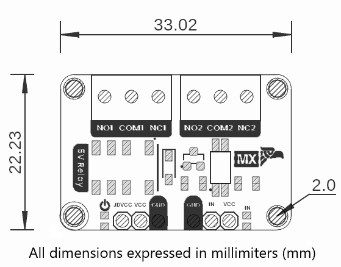

# Hardware

    <a href="#"> Schematic</a>
     

# Pinout

    <a href="#"> Pinout</a>
     

| Function                    | PCB Label | Description                                                      |
|-----------------------------|-----------|------------------------------------------------------------------|
| Relay coil supply           | JDVCC     | +5 V supply to energize the relay coils                          |
| Logic supply                | VCC       | MCU logic voltage (3.3 V or 5 V) for optocoupler/driver circuit  |
| Control input channel 1     | IN        | Logic-level input from MCU to activate relay channel 1           |
| Normally open contact 1     | NO1       | Relay 1 contact that closes when the coil is energized           |
| Common contact 1            | COM1      | Relay 1 common terminal                                          |
| Normally closed contact 1   | NC1       | Relay 1 contact that opens when the coil is energized            |
| Normally open contact 2     | NO2       | Relay 2 contact that closes when the coil is energized           |
| Common contact 2            | COM2      | Relay 2 common terminal                                          |
| Normally closed contact 2   | NC2       | Relay 2 contact that opens when the coil is energized            |
| Power indicator LED         | LED_PWR   | Lights whenever the module is powered (JDVCC present)            |
| Input-signal indicator LED  | LED_IN    | Lights or flashes to show an active IN signal from the MCU       |

---

# Dimensions

    <a href="#"> Dimensions</a>
     

