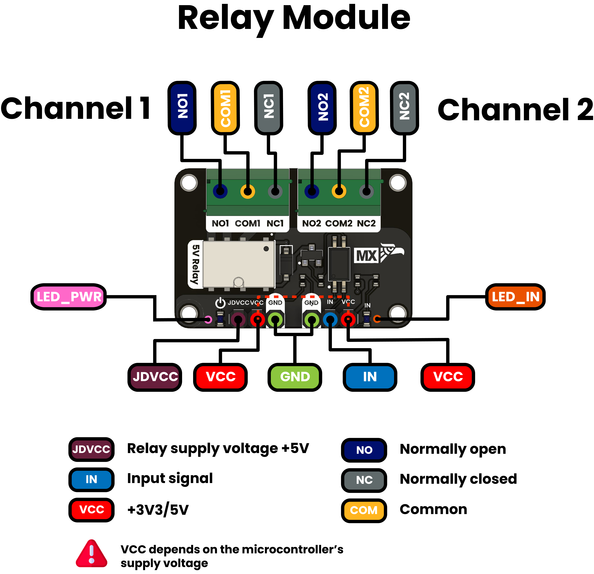
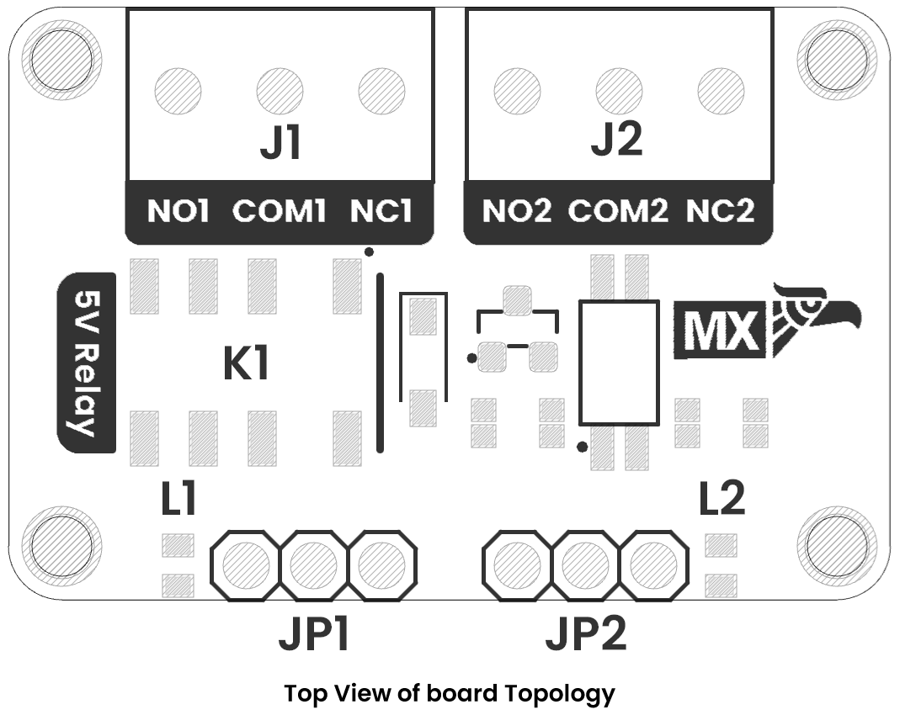

# Hardware

    <a href="resources/img/Schematics_icon.jpg"> Schematic</a>
     

# Pinout

    <a href="resources/unit_pinout_v_0_0_1_ue0082_relay_en.jpg"> Pinout</a>
     
     

| Function                    | PCB Label | Description                                                      |
|-----------------------------|-----------|------------------------------------------------------------------|
| Relay coil supply           | JDVCC     | +5 V supply to energize the relay coils                          |
| Logic supply                | VCC       | MCU logic voltage (3.3 V or 5 V) for optocoupler/driver circuit  |
| Control input channel 1     | IN        | Logic-level input from MCU to activate relay channel 1           |
| Normally open contact 1     | NO1       | Relay 1 contact that closes when the coil is energized           |
| Common contact 1            | COM1      | Relay 1 common terminal                                          |
| Normally closed contact 1   | NC1       | Relay 1 contact that opens when the coil is energized            |
| Normally open contact 2     | NO2       | Relay 2 contact that closes when the coil is energized           |
| Common contact 2            | COM2      | Relay 2 common terminal                                          |
| Normally closed contact 2   | NC2       | Relay 2 contact that opens when the coil is energized            |
| Power indicator LED         | LED_PWR   | Lights whenever the module is powered (JDVCC present)            |
| Input-signal indicator LED  | LED_IN    | Lights or flashes to show an active IN signal from the MCU       |

---

## **Important: Active Low Logic**

This relay module implements **optocoupler-based inverted logic**. The relay coils are energized when the control input (IN) receives a **LOW signal (0V)**, which is opposite to conventional direct relay control.

**Control Logic:**
- **Relay Energized (ON)**: IN pin = LOW (0V)
- **Relay De-energized (OFF)**: IN pin = HIGH (~VCC)

**Technical Reason:**  
The optocoupler isolates the MCU from the relay coil circuit. When the IN pin is driven LOW, current flows through the optocoupler LED, activating the output transistor which energizes the relay coil.

---

# Dimensions

    <a href="resources/dimensions.png"> Dimensions</a>
     

---

# Topology

    <a href="resources/unit_topology_v_0_0_1ue0082_modulo_rele_g6k_.png"> Topology</a>
     

