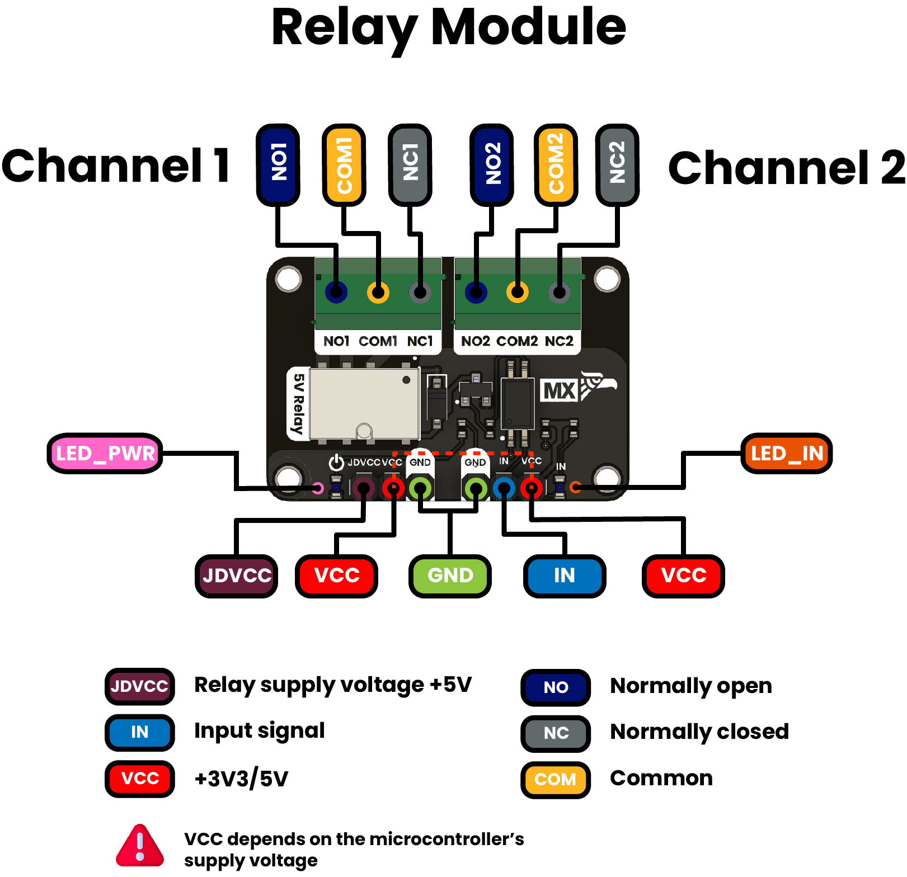
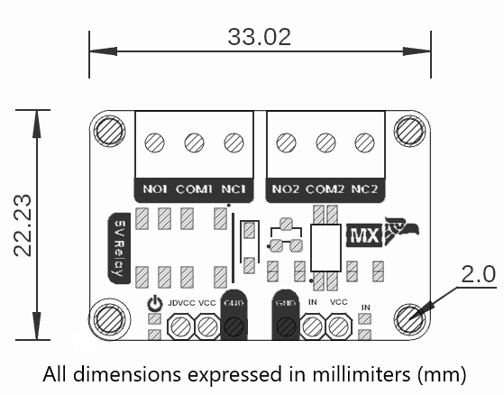

<!--
# README_TEMPLATE.md
Este archivo sirve como entrada para generar un PDF técnico estilo datasheet.
Edita las secciones respetando el orden, sin eliminar los encabezados.
-->
 <!-- logo -->

# UNIT Relay Module

## Introduction

This dual-channel relay module safely interfaces microcontrollers with higher-voltage or high-current loads by separating control from power. It features a dedicated 5V rail for the relay coils labeled JDVCC, while the logic supply labeled VCC matches the MCU’s operating voltage of 3.3V or 5V. Digital control signals applied to the IN pin trigger an optocoupler that activates the relay contacts. These contacts include normally open, normally closed, and common, labeled NO, NC, and COM respectively.Indicator LEDs labeled LED PWR and LED IN provide visual confirmation of the power and control signal status.

Designed for reliable switching in demanding applications, this two-channel relay module isolates high-power relay operations from sensitive MCU logic. It delivers a consistent +5V to the relay coils via JDVCC, while the logic supply labeled VCC provides the appropriate voltage level needed for input signal processing. When a digital high is applied at the IN pin, the module’s optocoupler engages to close the relay contacts among NO, NC, and COM as required. Additionally, the onboard LEDs signal the presence of power and active control, ensuring clear operational feedback.

## Functional Description

- 

## Electrical Characteristics & Signal Overview

- 

## Applications

-

## Features

- 

## Pin & Connector Layout

| Signal  | Description                                                       |
|---------|-------------------------------------------------------------------|
| JDVCC   | +5V supply to energize relay coils                                |
| VCC     | MCU logic voltage (3.3V or 5V) for the optocoupler/driver circuit     |
| IN      | MCU input to activate relay channel 1                             |
| NO1     | Relay 1 normally open contact                                       |
| COM1    | Relay 1 common terminal                                             |
| NC1     | Relay 1 normally closed contact                                     |
| NO2     | Relay 2 normally open contact                                       |
| COM2    | Relay 2 common terminal                                             |
| NC2     | Relay 2 normally closed contact                                     |
| LED_PWR | Indicator LED for power (active when JDVCC is present)              |
| LED_IN  | Indicator LED showing active input from the MCU                     |

## Settings

### Interface Overview

| Interface  | Signals / Pins            | Typical Use                                         |
|------------|----------------------------|-----------------------------------------------------|
| -      | -  | -       |

###  Supports 

| Symbol | I/O   | Description                         |
| ------ | ----- | ----------------------------------- |
| -    | -| Power supply (3.3V or 5V)           |

## Block Diagram

## Dimensions

## Usage

Works with:

- Arduino AVR
- Raspberry Pi RP2040
- STM32
- NRF
- PY32
- MAX II 

## Downloads

- [Schematic PDF](docs/schematic.pdf)

## Purchase

- [Buy from UNIT Electronics](https://www.uelectronics.com)
